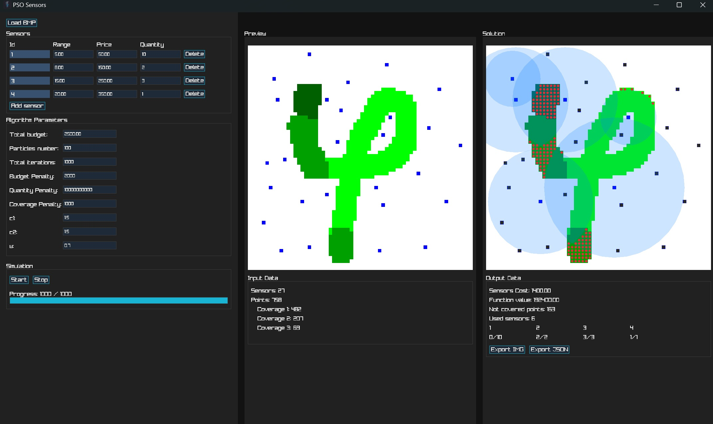

# PSO Sensor Placement

This project implements Particle Swarm Optimization for solving a sensor placement problem on a 2D grid generated from a bitmap image.

The goal is to select optimal sensor locations and types while satisfying coverage constraints, budget limits, and sensor availability, and minimizing uncovered areas and total cost.

The application includes a graphical interface built with raylib for configuration, visualization, and result export.

---

## Preview

---

## Features

- Bitmap based input for sensor candidates and coverage zones
- Multiple sensor types with configurable range cost and availability
- Particle Swarm Optimization with adjustable parameters
- Real time visualization of optimization progress
- Visual preview of final sensor coverage
- Export of results as image and structured data

---

## Input Format

The input is a BMP image where pixel colors define the problem structure

- 0 0 255 — Available sensor placement  
- 0 255 0 — Coverage point level 1  
- 0 150 0 — Coverage point level 2  
- 0 100 0 — Coverage point level 3  

Maximum image size is 1024 by 1024. Larger images are scaled down automatically.

---

## Algorithm Overview

Each particle represents a full assignment of sensor types to candidate locations.

Particle positions are mapped to discrete decisions where

- 0 means no sensor
- 1 to N represent sensor types

The optimization objective combines

- total deployment cost
- coverage penalties for uncovered points
- penalties for exceeding sensor availability
- penalties for exceeding budget

Lower values indicate better solutions.

---

## Configuration

### PSO parameters

- number of particles
- number of iterations
- inertia weight
- cognitive coefficient
- social coefficient

### Penalties

- coverage penalty
- availability penalty
- budget penalty

### Sensor configuration

For each sensor type

- range
- cost
- available quantity

---

## Output

After optimization completes the application provides

- final sensor placement visualization
- coverage map
- summary statistics including cost and coverage quality
- export options for image output and structured result data

---

## Dependencies

- raylib
- cJSON

---

## Notes

- Sensor type 0 represents no sensor placement
- The optimization runs incrementally to keep the UI responsive
- Large input data significantly increase computation cost and memory usage
